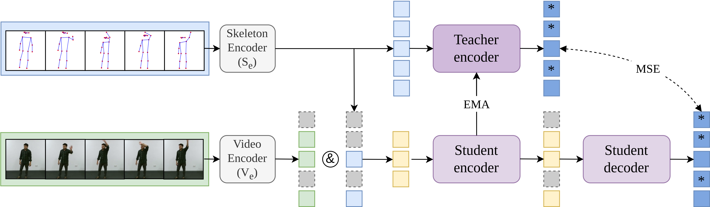

# SVdata2vec


## Overview

This repository includes PyTorch implementation of the paper SVdata2vec: 



## Abstract

Recent advancements in action recognition leverage both skeleton and video modalities to achieve state-of-the-art performance. However, due to the challenges of early fusion, which tends to underutilize the strengths of each
modality, existing methods often resort to late fusion, consequently leading to more complex designs. Additionally, self-supervised learning approaches utilizing both modalities remain underexplored. In this paper, we introduce SV-data2vec, a novel self-supervised framework for learning from skeleton and video data. Our approach employs a student-teacher architecture, where the teacher network generates contextualized targets based on skeleton data. The student network performs a masked prediction task using both skeleton and visual data. Remarkably, after pretraining with both modalities, our method allows for fine-tuning with RGB data alone, achieving results on par with multimodal approaches by effectively learning video representations through skeleton data guidance. Extensive experiments on benchmark datasets NTU
RGB+D 60, NTU RGB+D 120, and Toyota Smarthome confirm that our method outperforms existing RGB based state-of-the-art techniques.

## Install the required packages

```bash
pip install -r requirements.txt
```
## Instal mmcv and mmaction with mim

```bash
mim install mmcv-full
mim install mmaction2
```

## Prepare datasets

### NTU RGB+D 60 and 120

1.  Download the videos from the official [website](https://rose1.ntu.edu.sg/dataset/actionRecognition/) and put them in /data/nturgbd_raw. Compress them with the provided script (adjust paths in script): 

    ```python
    python process_data/compress_video.py
    ```
    
2. Download the skeleton annotation files from [mmaction](https://github.com/open-mmlab/mmaction2/blob/main/tools/data/skeleton/README.md)

### Toyota Smarthome

1.  Download the dataset from the official [website](https://project.inria.fr/toyotasmarthome/).

2.  Create annotations for Smarthome in the same format as NTU annotations with script (adjust paths in script): 

    ```python
    python process_data/smarthome_gendata.py
    ```
    
### Extract human bounding boxes

Extract the bounding boxes for the desired dataset (if fine-tuning the model with just the RGB modality):

```python
    python process_data/extract_human_bboxes.py
```

## Usage

To pretrain and finetune modify the data paths in congifs and refer to the provided bash scripts.


## Acknowledgment

This code is based on [MAMP](https://github.com/maoyunyao/MAMP), [mmaction2](https://github.com/open-mmlab/mmaction2/tree/main) and [data2vec](https://github.com/arxyzan/data2vec-pytorch). 


